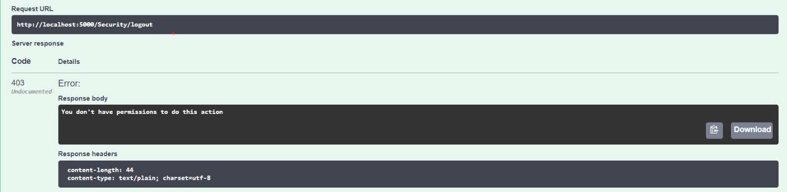
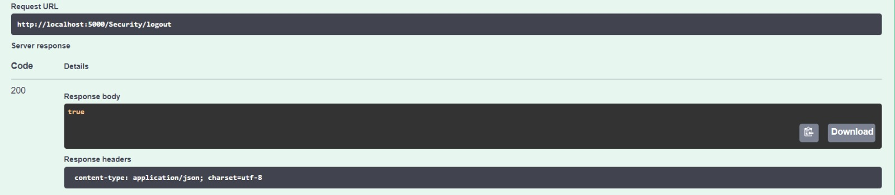

# Informe de identificación y justificación de los bugs en función de la clasificación elegida:

A continuación detallaremos los dos bugs que elegimos para solucionar, el por qué los elegimos y otros bugs que tuvimos en consideración para reparar.

Para elegir los bugs, tomamos los que elegimos como más prioritarios en la entrega anterior, y nos basamos en que tanto pueden impactar tanto a la aplicación como a los usuarios, pensando en posibles escenarios en los cuales pueda ocurrir, y las consecuencias que pueden traer.

## Bugs elegidos:

### Arreglar el registro de usuarios:

El PO, revisando los requerimientos del sistema, vió que no cualquier rol podía crear usuarios, solo los administradores los podían crear, y ya hay una sección de alta de usuarios a la cual solo pueden acceder usuarios con rol de administrador. Por lo tanto se llegó a la conclusión de que el botón de registrarse no debería de existir, ya que dicha funcionalidad no existe en el sistema.

El registro de usuarios es una funcionalidad crítica para cualquier sistema que requiere de usuarios para acceder a sus funcionalidades. Si este proceso no está expresado claramente, puede dar lugar a confusiones en los usuarios, los cuales no podrán registrarse en el sistema. Esto impide que la cantidad de usuarios que puedan utilizar la aplicación aumente y, por lo tanto, la capacidad de la aplicación para cumplir con su propósito.

Además de eliminar el botón, se agregó un breve mensaje en la pantalla de inicio de sesión, la cual informa al usuario de que si no tiene una cuenta, se ponga en contacto con un administrador para poder crear una.

Para arreglar este problema, no se usó TDD, ya que es un problema de front-end, por lo tanto simplemente bastó con realizar los cambios, y verlos reflejados en la página al levantar la solución de angular, corroborando que todo quedó bien.

### Cierre de sesión como rol de artista:

Si bien no es una falla crítica al nivel del registro de usuarios, el PO argumentó que el hecho de no poder cerrar sesión es una falla que puede ser muy molesta para managers que utilizan cuentas de varios artistas, ya que no podrán iniciar sesión en cada cuenta de artista para acceder a la información correspondiente, dado que al ser una aplicación que se utiliza en el ámbito laboral del artista, es normal que alguien más maneje su cuenta en la aplicación.

Además, este problema representa un riesgo de seguridad, ya que las sesiones de los usuarios no se cerrarán correctamente y cualquiera que tenga acceso a la computadora del usuario podría acceder a la información del artista.

#### Solución: (Decidimos incluir esto en el documento por las razones explicadas a continuación)

Al tratarse de un cambio en los filtros de la WebApi, no pudimos aplicar TDD de forma estricta, dado que no es posible hacer pruebas unitarias de los filtros de un endpoint en particular. De todas formas quisimos acercarnos lo máximo posible a TDD, por lo que se aplicó esta metodología utilizando tests de integración en vez de unitarios. Estos tests de integración fueron realizados con swagger UI, y no son visibles en el código, por lo que los documentamos aquí:
Teniendo una sesión iniciada con un usuario de rol artista, antes de reparar el bug comenzamos corriendo un test de integración que falló:

Se puede observar que el usuario que intentó terminar la sesión no tiene permisos para hacerlo, pero debería tenerlos.

Luego, reparamos el bug y corrimos el test nuevamente. Esta vez sí cuenta con los permisos para hacerlo y el endpoint devuelve true:

## Bugs que también se consideraron:

### Errores en la sección “Mis datos”:

Para algunos roles (vendedor, acomodador y espectador) vimos que no se precargan los datos, y además para el espectador, da un error interno en el sistema al querer cambiarlos.

El PO no consideró priorizar este bug, ya que luego de evaluar el impacto en el sistema, se llegó a la conclusión de que no es una falla crítica en la usabilidad y funcionamiento del sistema, de todos modos, en caso de querer ver nombre y apellido con el cual los usuarios registraron, se pueden visualizar en la esquina superior derecha en la pantalla principal.

Puede ser molesto para un espectador que ingresó mal sus datos, ya que la solución por el momento sería crear otro usuario con los datos correctos.

En caso de implementar una futura solución, se quitaría la sección para los roles vendedor y acomodador, ya que estos no tienen el permiso necesario para ejecutar esta acción, por lo tanto no tiene sentido que les aparezca para entrar. Y para el caso del espectador, los desarrolladores deberían investigar más a fondo sobre la causa del error y por qué no precargan los datos.

### Importar/Exportar conciertos:

El PO decidió no priorizar esta funcionalidad, ya que es una alternativa al uso común del sistema, ya que si se necesita crear un concierto, se puede hacer de manera manual, y en caso de querer exportar, tenemos acceso a los datos del concierto en la página.

Se optó por priorizar los problemas que impacten la usabilidad de manera que no haya un camino alternativo para realizar una acción dentro de la aplicación.

Otra de las razones por las cuales no se priorizó es porque se hizo una investigación más a fondo de parte de los desarrolladores sobre cuál es el error que está causando que esta funcionalidad falle, y al llevar más tiempo de lo que se pensó, se el PO decidió no perder más tiempo de trabajo en esta funcionalidad.
