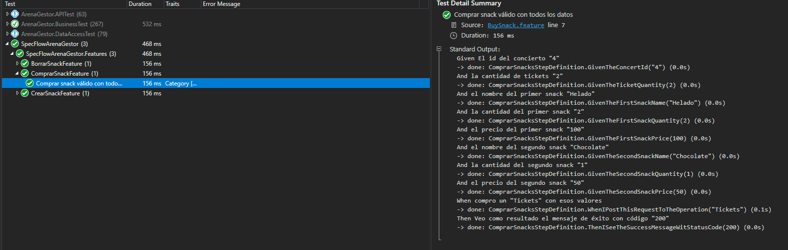

# Compra de snacks

En esta entrega incluimos la funcionalidad de comprar snacks, que había faltado implementar en la entrega pasada. En el contexto de los objetivos de la entrega 3, la funcionalidad fue desarrollada utilizando BDD, y utilizando specflow para los casos de prueba. En la siguiente imagen se muestra la evidencia de los casos de prueba correspondientes.

Además, como se pedía en la entrega anterior, se realizó el video de revisión de esta nueva funcionalidad con el PO. [Link al video](https://youtu.be/Wlv9Dn_OCJQ)
